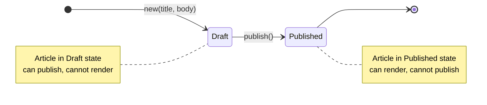
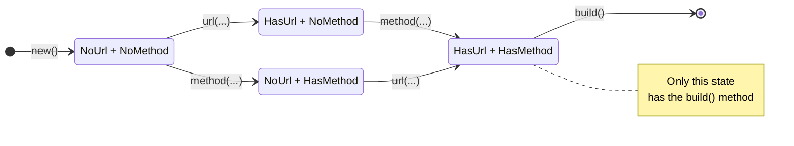

# 结构体 (structs)

> 结构体（Struct）是 Rust 把一组相关数据"捏成一个整体"的核心手段。
> 它让你从"一堆散落的变量"升级到"有名字、有边界、有行为的类型"，
> 并自然地把所有权、借用、生命周期这些机制贯穿进来。

在上一章 `06引用与借用` 中，我们学会了怎么让函数「借一下数据、看一眼就还」，而不是把所有权到处搬。这些能力在只操作单一变量（`String`、`Vec<T>`）时已经足够用。但一旦你开始描述真实的业务对象，问题就来了：

```rust
// ❌ 这种写法只要一多就立刻失控
fn create_user() -> (u64, String, String, bool, u32) {
    (1, String::from("alice"), String::from("alice@x.com"), true, 30)
}

fn main() {
    let (id, name, email, active, age) = create_user();
    println!("id={id}, name={name}, email={email}, active={active}, age={age}");
}
```

这个签名有几个明显的坏处：

- 参数 / 返回值里一旦字段顺序变了，调用方很容易搞错；
- 元组字段只能用 `.0`、`.1` 访问，完全不表达"这个字段是谁"；
- 加新字段几乎必然要修改所有调用点；
- 类型系统没办法拒绝「签名相同但含义不同」的数据（`(u64, String, String, bool, u32)` 可能是 User，也可能是 Order）。

本章就是让你把上面这种代码彻底丢掉，换成结构体风格的设计：

```rust
struct User {
    id: u64,
    name: String,
    email: String,
    active: bool,
    age: u32,
}

fn create_user() -> User {
    User { id: 1, name: "alice".into(), email: "alice@x.com".into(), active: true, age: 30 }
}
```

本章你将彻底掌握：

- 三种结构体形态：具名字段 / 元组 / 单元
- 实例创建的各种语法：全字段、简写、更新语法
- `impl` 块与方法：`&self` / `&mut self` / `self`
- 关联函数（构造器模式、`Self` 类型、命名惯例）
- 常用派生宏：`Debug`、`Clone`、`Copy`、`PartialEq`、`Eq`、`Hash`、`Default`
- 结构体所有权：部分 move、分字段借用、`String` vs `&str` 字段
- **泛型结构体**：`struct Point<T>`、特化 impl、trait bound、单态化
- **生命周期参数**：`struct Foo<'a>`、省略规则、多个独立生命周期
- **trait 实现秀**：`Display` / `From` / `Add` / `Iterator` 自定义
- **构建器模式**：轻量、独立、Type-State 三层实现
- **内存布局与零成本抽象**：`size_of` / `align_of` / `repr(C)` / Newtype 零开销
- **单元测试**：`cargo test` 与 `#[cfg(test)]`
- 实战：`Rectangle` 全家桶，综合前九个示例

---

## 示例文件

| 文件 | 主题 | 运行 |
|------|------|------|
| `examples/01_struct_basics.rs` | 定义、实例化、字段访问、可变性 | `cargo run --example 01_struct_basics` |
| `examples/02_field_init_shorthand.rs` | 字段初始化简写语法 | `cargo run --example 02_field_init_shorthand` |
| `examples/03_struct_update_syntax.rs` | 结构体更新语法 `..base` 与 move 规则 | `cargo run --example 03_struct_update_syntax` |
| `examples/04_tuple_structs.rs` | 元组结构体与 Newtype 模式 | `cargo run --example 04_tuple_structs` |
| `examples/05_unit_structs.rs` | 单元结构体与零大小类型 | `cargo run --example 05_unit_structs` |
| `examples/06_methods.rs` | `impl` 块、`&self` / `&mut self` / `self` | `cargo run --example 06_methods` |
| `examples/07_associated_functions.rs` | 关联函数、构造器、`Self` 类型 | `cargo run --example 07_associated_functions` |
| `examples/08_debug_and_derives.rs` | `Debug` 派生、常用 derives、`dbg!` 宏 | `cargo run --example 08_debug_and_derives` |
| `examples/09_ownership_in_structs.rs` | 结构体所有权、部分 move、分字段借用 | `cargo run --example 09_ownership_in_structs` |
| `examples/10_rectangle.rs` | 综合练习：`Rectangle` 全家桶 + 单元测试 | `cargo run --example 10_rectangle` / `cargo test --example 10_rectangle` |
| `examples/11_generics_in_structs.rs` | 泛型结构体、特化 impl、trait bound、单态化 | `cargo run --example 11_generics_in_structs` |
| `examples/12_lifetimes_in_structs.rs` | 结构体生命周期参数、省略规则、`&'static` | `cargo run --example 12_lifetimes_in_structs` |
| `examples/13_trait_impl_showcase.rs` | `impl Display` / `From` / `Add` / `Iterator` | `cargo run --example 13_trait_impl_showcase` |
| `examples/14_builder_pattern.rs` | 构建器模式三层实现（含 Type-State） | `cargo run --example 14_builder_pattern` |
| `examples/15_memory_layout.rs` | 内存布局、零成本抽象、`repr` 属性 | `cargo run --example 15_memory_layout` |

---

## 目录

- [结构体 (structs)](#结构体-structs)
  - [示例文件](#示例文件)
  - [目录](#目录)
  - [一、为什么需要结构体](#一为什么需要结构体)
    - [1.1 没有结构体的痛苦](#11-没有结构体的痛苦)
    - [1.2 结构体：让数据有「身份」](#12-结构体让数据有身份)
    - [1.3 结构体 vs 其它语言](#13-结构体-vs-其它语言)
  - [二、定义与实例化](#二定义与实例化)
    - [2.1 定义结构体](#21-定义结构体)
    - [2.2 创建实例](#22-创建实例)
    - [2.3 字段访问](#23-字段访问)
    - [2.4 可变性是「整体」而不是「字段级」](#24-可变性是整体而不是字段级)
  - [三、字段初始化简写](#三字段初始化简写)
  - [四、结构体更新语法](#四结构体更新语法)
    - [4.1 基础语法](#41-基础语法)
    - [4.2 `..base` 的 move 规则（关键）](#42-base-的-move-规则关键)
    - [4.3 与 `Default::default()` 搭配](#43-与-defaultdefault-搭配)
  - [五、元组结构体](#五元组结构体)
    - [5.1 基础语法](#51-基础语法)
    - [5.2 不同名字 = 不同类型](#52-不同名字--不同类型)
    - [5.3 Newtype 模式](#53-newtype-模式)
  - [六、单元结构体](#六单元结构体)
    - [6.1 语法与零大小类型](#61-语法与零大小类型)
    - [6.2 作为 trait 挂载点](#62-作为-trait-挂载点)
    - [6.3 作为类型状态机的状态标签](#63-作为类型状态机的状态标签)
  - [七、方法（Methods）](#七方法methods)
    - [7.1 `impl` 块](#71-impl-块)
    - [7.2 三种接收者：`&self` / `&mut self` / `self`](#72-三种接收者self--mut-self--self)
    - [7.3 自动引用与自动解引用](#73-自动引用与自动解引用)
    - [7.4 多个 `impl` 块](#74-多个-impl-块)
  - [八、关联函数（Associated Functions）](#八关联函数associated-functions)
    - [8.1 什么是关联函数](#81-什么是关联函数)
    - [8.2 构造器命名惯例](#82-构造器命名惯例)
    - [8.3 `Self` 类型别名](#83-self-类型别名)
    - [8.4 关联常量](#84-关联常量)
  - [九、派生宏（derive）](#九派生宏derive)
    - [9.1 `Debug`：开发调试](#91-debug开发调试)
    - [9.2 `Clone` 与 `Copy`](#92-clone-与-copy)
    - [9.3 `PartialEq` / `Eq` / `Hash`](#93-partialeq--eq--hash)
    - [9.4 `PartialOrd` / `Ord`](#94-partialord--ord)
    - [9.5 `Default`](#95-default)
    - [9.6 `dbg!` 宏](#96-dbg-宏)
  - [十、结构体所有权](#十结构体所有权)
    - [10.1 结构体拥有其字段](#101-结构体拥有其字段)
    - [10.2 部分 move（partial move）](#102-部分-movepartial-move)
    - [10.3 分字段借用](#103-分字段借用)
    - [10.4 `String` 字段 vs `&str` 字段](#104-string-字段-vs-str-字段)
    - [10.5 自引用结构体为什么很难](#105-自引用结构体为什么很难)
  - [十一、字段可见性](#十一字段可见性)
  - [十二、实战：Rectangle 全家桶](#十二实战rectangle-全家桶)
  - [十三、泛型结构体](#十三泛型结构体)
    - [13.1 为什么需要泛型](#131-为什么需要泛型)
    - [13.2 基础语法：`struct S<T>`](#132-基础语法struct-st)
    - [13.3 特化 impl 与 trait bound](#133-特化-impl-与-trait-bound)
    - [13.4 单态化：零成本的秘密](#134-单态化零成本的秘密)
  - [十四、结构体生命周期](#十四结构体生命周期)
    - [14.1 为什么需要 `'a`](#141-为什么需要-a)
    - [14.2 经典例子：`ImportantExcerpt<'a>`](#142-经典例子importantexcerpta)
    - [14.3 生命周期省略规则](#143-生命周期省略规则)
    - [14.4 多个独立生命周期](#144-多个独立生命周期)
    - [14.5 `&'static` 字段](#145-static-字段)
    - [14.6 何时用借用字段、何时用拥有字段](#146-何时用借用字段何时用拥有字段)
  - [十五、trait 实现秀](#十五trait-实现秀)
    - [15.1 `impl Display`：面向用户输出](#151-impl-display面向用户输出)
    - [15.2 `impl From<T>`：优雅的类型转换](#152-impl-fromt优雅的类型转换)
    - [15.3 运算符重载：`Add` / `Mul` / `AddAssign`](#153-运算符重载add--mul--addassign)
    - [15.4 `impl Iterator`：让结构体融入迭代器生态](#154-impl-iterator让结构体融入迭代器生态)
  - [十六、构建器模式](#十六构建器模式)
    - [16.1 轻量 `with_xxx` 链式](#161-轻量-with_xxx-链式)
    - [16.2 独立 Builder + `build() -> Result`](#162-独立-builder--build---result)
    - [16.3 Type-State Builder：编译期强制必填](#163-type-state-builder编译期强制必填)
  - [十七、内存布局与零成本抽象](#十七内存布局与零成本抽象)
    - [17.1 `size_of` 与 `align_of`](#171-size_of-与-align_of)
    - [17.2 字段顺序与 padding](#172-字段顺序与-padding)
    - [17.3 零大小类型（ZST）](#173-零大小类型zst)
    - [17.4 Newtype 零开销证明](#174-newtype-零开销证明)
    - [17.5 `repr` 属性全景](#175-repr-属性全景)
    - [17.6 Option 的 Null Pointer Optimization (NPO)](#176-option-的-null-pointer-optimization-npo)
    - [17.7 PhantomData：只骗类型系统不占空间](#177-phantomdata只骗类型系统不占空间)
  - [十八、单元测试](#十八单元测试)
    - [18.1 基础用法](#181-基础用法)
    - [18.2 `#[cfg(test)]` 是怎么工作的](#182-cfgtest-是怎么工作的)
    - [18.3 常用断言宏](#183-常用断言宏)
    - [18.4 集成测试 vs 单元测试](#184-集成测试-vs-单元测试)
  - [十九、结构体在真实世界](#十九结构体在真实世界)
    - [19.1 结构体的八种典型角色](#191-结构体的八种典型角色)
    - [19.2 真实库里的典型例子](#192-真实库里的典型例子)
    - [19.3 从结构体到系统架构](#193-从结构体到系统架构)
  - [二十、常见错误与易错点](#二十常见错误与易错点)
    - [1. 创建实例时漏了字段](#1-创建实例时漏了字段)
    - [2. 不可变实例想改字段](#2-不可变实例想改字段)
    - [3. 更新语法后继续用被部分 move 的 base](#3-更新语法后继续用被部分-move-的-base)
    - [4. 把 `&String` 当成通用参数类型](#4-把-string-当成通用参数类型)
    - [5. 忘记给 base 派生 `Copy` 但又想多次用](#5-忘记给-base-派生-copy-但又想多次用)
    - [6. 把 struct 当成可以继承的东西](#6-把-struct-当成可以继承的东西)
    - [7. 自引用结构体](#7-自引用结构体)
    - [8. 元组结构体字段太多，访问变难读](#8-元组结构体字段太多访问变难读)
    - [9. 派生 `Copy` 时字段含 `String`](#9-派生-copy-时字段含-string)
    - [10. 忘记给方法调用对象加 `mut`](#10-忘记给方法调用对象加-mut)
  - [二十一、API 设计准则](#二十一api-设计准则)
    - [1. 方法接收者的选择](#1-方法接收者的选择)
    - [2. 字符串参数与字段的选型](#2-字符串参数与字段的选型)
    - [3. 派生选型](#3-派生选型)
    - [4. 构造器设计](#4-构造器设计)
    - [5. 封装与可见性](#5-封装与可见性)
  - [二十二、综合练习](#二十二综合练习)
    - [练习 1：User 全家桶](#练习-1user-全家桶)
    - [练习 2：Rectangle 扩展](#练习-2rectangle-扩展)
    - [练习 3：Newtype 单位](#练习-3newtype-单位)
    - [练习 4：类型状态机](#练习-4类型状态机)
    - [练习 5：HashMap 作为索引](#练习-5hashmap-作为索引)
    - [练习 6：借用型结构体](#练习-6借用型结构体)
    - [练习 7：部分 move 手搓](#练习-7部分-move-手搓)
    - [练习 8：`..Default::default()` 命名参数](#练习-8defaultdefault-命名参数)
  - [要点总结](#要点总结)
    - [三种结构体形态](#三种结构体形态)
    - [定义与使用](#定义与使用)
    - [更新语法 `..base`](#更新语法-base)
    - [impl 块与方法](#impl-块与方法)
    - [关联函数](#关联函数)
    - [派生宏组合](#派生宏组合)
    - [所有权](#所有权)
    - [最实用的判断准则](#最实用的判断准则)

---

## 一、为什么需要结构体

### 1.1 没有结构体的痛苦

当你用「散装变量 + 元组」表达一个业务对象时，问题很快就冒出来：

```rust
fn build_user() -> (u64, String, String, bool, u32) {
    (1, String::from("alice"), String::from("alice@x.com"), true, 30)
}

fn main() {
    let (id, name, email, active, age) = build_user();
    // 这组变量之间没有「身份」，如果函数签名变了，一大片调用点都要改
}
```

具体的痛点：

- **参数顺序依赖**：元组只能按位置访问（`.0`、`.1`...），漏一个、多一个都灾难；
- **没有语义**：`(u64, String, String, bool, u32)` 可以是 User，也可以是 Order，编译器帮不了你；
- **字段无名字**：看到 `info.3` 不知道它是 `active` 还是 `is_admin`；
- **扩展困难**：多加一个字段，所有解构都得改。

图示直观对比：

```text
  散装元组 (痛苦):
  ┌──────────────────────────────────┐
  │ (u64, String, String, bool, u32) │   ← 一串裸类型, 编译器无法拒绝"同签名不同义"
  │    ^    ^      ^      ^    ^     │
  │    .0   .1     .2     .3   .4    │   ← 只能按位置 (.0 / .1) 访问, 顺序错 = 乱
  └──────────────────────────────────┘
     "这些字段分别是谁?" 靠位置记忆, 改一处乱全家


  结构体 (舒服):
  ┌──────────────────────────┐
  │ struct User {            │
  │   id:     u64,           │
  │   name:   String,        │   ← 每个字段有名字, 顺序可换, 加字段不影响访问
  │   email:  String,        │
  │   active: bool,          │
  │   age:    u32,           │
  │ }                        │
  └──────────────────────────┘
     u.name / u.age — 一看就懂, 编译器也能帮你校对


  "同结构不同义" 两种类型, 编译器能拦截混用:
  ┌──────────────────────┐       ┌──────────────────────┐
  │ struct User  {       │       │ struct Order {       │
  │   id, name, ...      │  !=   │   id, name, ...      │   ← 即使字段一样,
  │ }                    │       │ }                    │      在类型系统里
  └──────────────────────┘       └──────────────────────┘      也是独立类型
```

### 1.2 结构体：让数据有「身份」

结构体把这些散装的数据"收编"成一个具名类型：

```rust
struct User {
    id: u64,
    name: String,
    email: String,
    active: bool,
    age: u32,
}

fn build_user() -> User {
    User {
        id: 1,
        name: String::from("alice"),
        email: String::from("alice@x.com"),
        active: true,
        age: 30,
    }
}

fn main() {
    let u = build_user();
    println!("{}: {}", u.id, u.name);
}
```

收获立竿见影：

- **类型安全**：`User` 和 `Order` 即使字段结构相同，也是两种完全不同的类型，编译器能拦截混用；
- **字段有名字**：`u.name` 比 `info.1` 一眼就懂；
- **扩展友好**：加字段不影响字段访问代码（只影响构造处）；
- **绑定行为**：可以 `impl User { ... }` 给它挂方法、关联函数、trait 实现。

### 1.3 结构体 vs 其它语言

| 语言 | 类比概念 | 与 Rust 结构体最大不同 |
|------|----------|------------------------|
| JavaScript | object / class | JS 对象字段可随意增减；Rust 字段在定义时固定 |
| Python | class | Python 方法/属性可动态挂载；Rust 都在 `impl` 里定义 |
| Java | class（无方法版的） | Java 有继承；Rust 没有继承，用组合 + trait 表达 |
| C | struct | C 结构体没有方法；Rust 结构体可以挂方法 |
| Go | struct + receiver method | 很像！Go 是 Rust 结构体 + 方法最接近的亲戚 |

核心直觉：**Rust 结构体 = C struct（数据布局）+ 方法（通过 impl 挂行为）+ 类型系统（每个 struct 是独立类型）**。

---

## 二、定义与实例化

### 2.1 定义结构体

结构体定义通常写在 `main` 之外，字段和类型都要在编译期确定：

```rust
struct User {
    username: String,  // 拥有型字段
    email: String,
    age: u32,          // Copy 字段
    active: bool,
}
```

字段类型可以是：

- 基本类型：`i32` / `bool` / `f64` / `char`
- 拥有型类型：`String` / `Vec<T>` / `Box<T>` / 其他结构体
- 借用型类型：`&str` / `&[T]` / `&T`（需要生命周期参数）
- 泛型参数：`T`（后续章节展开）

### 2.2 创建实例

定义只是给出了"图纸"，创建实例才是真正造出一个东西：

```rust
let alice = User {
    username: String::from("alice"),
    email: String::from("alice@example.com"),
    age: 30,
    active: true,
};
```

**关键规则：**

1. 所有字段都要一次性写完，不能漏（除非用 `..base` 补齐）；
2. 字段按**名字**匹配，不按位置匹配，所以顺序可以随意；
3. 字段类型必须精确匹配，不会有隐式转换。

### 2.3 字段访问

用 `.` 运算符访问字段，跟 C / JS / Python 完全一致：

```rust
println!("name = {}", alice.username);
let age = alice.age;                     // Copy 字段，直接复制
let name_ref: &String = &alice.username; // 字段借用
```

字段访问完全遵守所有权 / 借用规则：

```rust
let name = alice.username;               // ⚠️ move：name 拿走所有权
// println!("{}", alice.username);       // ❌ alice.username 已 move
println!("{}", alice.age);               // ✅ age 是 Copy，不影响
```

### 2.4 可变性是「整体」而不是「字段级」

Rust 没有字段级的 `mut`，可变性总是作用于整个实例：

```text
  let mut u = User { .. }               let u = User { .. }
  ──────────────────────────            ──────────────────────────
   mut (作用于整个实例)                 (不可变)
   ┌─────┬──────┬─────────┐             ┌─────┬──────┬─────────┐
   │ id  │ name │ ... age │             │ id  │ name │ ... age │
   └─────┴──────┴─────────┘             └─────┴──────┴─────────┘
     ↑ 任何字段都可改                     ↑ 任何字段都不能改


  不存在的语法 (字段级 mut):            想让某个字段在不可变实例里可变:
  ──────────────────────────            ─────────────────────────────
  struct S {                            use std::cell::Cell;
    mut age: u32,       // ❌           struct S {
    name: String,                         age: Cell<u32>,
  }                                       name: String,
  // 整个语言都不支持                    }

                                        let s = S { .. };   // 不 mut
                                        s.age.set(99);      // ✅ 仍可改
                                        // "内部可变性" 模式
```

```rust
// ❌ 这种语法不存在
// struct User { mut age: u32, name: String }

// ✅ 要修改字段，整个实例都得 mut
let mut u = User { username: "bob".into(), email: "b@x.com".into(), age: 25, active: true };
u.age += 1;                              // 合法：u 是 mut
```

一个不可变实例的所有字段都不能改：

```rust
let frozen = User { username: "c".into(), email: "c@x.com".into(), age: 0, active: false };
// frozen.age = 1;   // ❌ cannot assign to `frozen.age`, as `frozen` is not mutable
```

> 想只把某个字段做成"可变"？标准答案是用 `Cell<T>` / `RefCell<T>` 做"内部可变性"。这是智能指针章节的话题，这里只需要先知道：**Rust 没有字段级 mut 修饰符**。

---

## 三、字段初始化简写

当"局部变量名"和"字段名"一致时，可以省略重复的部分：

```rust
fn build_user(username: String, email: String) -> User {
    // 传统写法：每个字段写两遍
    // User { username: username, email: email, age: 0, active: true }

    // 简写：同名直接写一次即可
    User {
        username,
        email,
        age: 0,        // 字面量还是要写 `名字: 值`
        active: true,
    }
}
```

简写的三条规则：

1. 只在"变量名 == 字段名"时生效；
2. 字段顺序随意，和常规字面量一样；
3. 语义与 `field: field` 完全相同（仍然会 move，不是 "引用赋值"）。

典型应用：工厂函数、构造器、参数直映射字段的场景。

```rust
struct Point { x: f64, y: f64 }

fn make_point(x: f64, y: f64) -> Point {
    Point { x, y }                       // 又短又自然
}
```

---

## 四、结构体更新语法

### 4.1 基础语法

已有一个实例，只想改几个字段，其他照搬过来？用 `..base`：

```rust
let u1 = User {
    username: "alice".into(),
    email: "alice@old.com".into(),
    age: 30,
    active: true,
};

let u2 = User {
    email: "alice@new.com".into(),
    ..u1                                 // 剩下的字段从 u1 取
};
```

这里的 `..u1` 等价于：把 `u1` 里没被显式覆盖的字段，按字段逐个 `move` 或 `copy` 过来。

**`..base` 必须写在最后**，不能写在前面或中间。

### 4.2 `..base` 的 move 规则（关键）

这是最容易踩坑的地方。

`..base` 是**字段级**复制/move：

- 字段是 `Copy`（`u32`、`bool`、`f64`...） → **按位复制**，base 的该字段不受影响；
- 字段不是 `Copy`（`String`、`Vec<T>`...） → **所有权被 move 走**，base 的该字段失效。

更进一步，base 作为一个整体是否还能用，取决于：

> **是否有任何非 Copy 字段被 move 走**。
>
> - 有 → base 不能作为"一个完整的实例"再使用，但没被 move 的字段可以单独访问
> - 无 → base 仍然完整可用（典型场景：结构体字段全 Copy，或显式覆盖了所有非 Copy 字段）

直观对比两种场景：

```text
┌──────────────────────────────────────────────────────────────────────────┐
│ 场景 A: 只覆盖 Copy 字段, username/email 被 move 走                         │
└──────────────────────────────────────────────────────────────────────────┘

  src: User                               let u_a = User {
  ┌──────────────────┐                      age: 99,
  │ username: "src"  │ ────move────▶         active: false,
  │ email:    "s@x"  │ ────move────▶         ..src
  │ age:      10     │ ────copy────▶       };   (但 age 会被覆盖为 99)
  │ active:   true   │ ────copy────▶            (active 会被覆盖为 false)
  └──────────────────┘

                                     u_a: User
                                    ┌──────────────────┐
                                    │ username: "src"  │  ← 从 src move 过来
                                    │ email:    "s@x"  │  ← 从 src move 过来
                                    │ age:      99     │  ← 显式覆盖
                                    │ active:   false  │  ← 显式覆盖
                                    └──────────────────┘

  之后 src 的状态:
  ┌──────────────────┐
  │ username: [moved]│  ← 不能访问
  │ email:    [moved]│  ← 不能访问
  │ age:      10     │  ← Copy 字段永远可读
  │ active:   true   │  ← Copy 字段永远可读
  └──────────────────┘

    println!("{:?}", src)      ❌  src 作为整体不完整
    println!("{}", src.age)    ✅  但没被 move 的字段可单独访问


┌──────────────────────────────────────────────────────────────────────────┐
│ 场景 B: 显式覆盖所有非 Copy 字段, src2 完好无损                               │
└──────────────────────────────────────────────────────────────────────────┘

  src2: User                              let u_b = User {
  ┌──────────────────┐                      username: "new",      ← 显式覆盖
  │ username: "src2" │   (不需要 move,      email:    "n@x",      ← 显式覆盖
  │ email:    "s2@x" │    已被显式覆盖)      ..src2
  │ age:      20     │ ────copy────▶       };
  │ active:   true   │ ────copy────▶
  └──────────────────┘

  之后 src2 的状态:
  ┌──────────────────┐
  │ username: "src2" │  ← 完整
  │ email:    "s2@x" │  ← 完整       所有字段都还在,
  │ age:      20     │  ← 完整       src2 继续作为完整实例使用
  │ active:   true   │  ← 完整
  └──────────────────┘

    println!("{:?}", src2)     ✅
```

核心直觉：**`..base` 是按字段逐个处理的，不是整体 move。Copy 字段按位复制、非 Copy 字段 move，是否显式覆盖非 Copy 字段决定了 base 后续还能不能整体使用。**

示例：

```rust
let src = User {
    username: "src".into(),
    email: "src@x.com".into(),
    age: 10,
    active: true,
};

// 情况 A：只覆盖 Copy 字段，username/email 被 move 走
let u_a = User {
    age: 99,
    active: false,
    ..src
};
// println!("{}", src.username);         // ❌ 已 move
// println!("{:?}", src);                // ❌ 整体不完整
println!("{}", src.age);                 // ✅ Copy 字段仍可访问

// 情况 B：显式覆盖所有非 Copy 字段
let src2 = User {
    username: "src2".into(),
    email: "src2@x.com".into(),
    age: 20,
    active: true,
};
let u_b = User {
    username: "new".into(),              // ← 覆盖非 Copy
    email: "new@x.com".into(),           // ← 覆盖非 Copy
    ..src2
};
println!("{:?}", src2.username);         // ✅ src2 完好无损，Rust 只 copy 了 age/active
```

### 4.3 与 `Default::default()` 搭配

最惯用的"命名参数"替代方式：

```rust
#[derive(Default, Debug)]
struct Config {
    host: String,
    port: u16,
    tls: bool,
    timeout_ms: u64,
}

let cfg = Config {
    host: String::from("127.0.0.1"),
    port: 8080,
    ..Default::default()                 // tls = false, timeout_ms = 0
};
```

这是 Rust 社区里非常流行的写法：只显式写"你关心的字段"，其余走默认值。它的语义完全由 `Default` trait 提供，详见第九章。

---

## 五、元组结构体

### 5.1 基础语法

元组结构体长得像"有名字的元组"：字段没名字，只有位置：

```rust
struct Color(u8, u8, u8);                // RGB
struct Point3D(i32, i32, i32);

let red = Color(255, 0, 0);
let origin = Point3D(0, 0, 0);

// 按位置访问
println!("R={}, G={}, B={}", red.0, red.1, red.2);
```

可以像元组那样解构：

```rust
let Color(r, g, b) = red;
fn print_rgb(Color(r, g, b): Color) {
    println!("({r}, {g}, {b})");
}
```

### 5.2 不同名字 = 不同类型

即使字段结构完全一样，不同的元组结构体仍然是**两种独立类型**：

```rust
struct A(i32, i32);
struct B(i32, i32);

let a: A = A(1, 2);
// let a2: A = B(3, 4);  // ❌ mismatched types
```

这个特性是元组结构体最大的价值来源。

### 5.3 Newtype 模式

Newtype 是**只有一个字段**的元组结构体，用来给已有类型加上新类型身份：

```rust
struct Meters(f64);
struct Kilometers(f64);

fn run_m(d: Meters) { println!("{} m", d.0); }
fn run_km(d: Kilometers) { println!("{} km", d.0); }

run_m(Meters(5000.0));                   // ✅
// run_m(Kilometers(5.0));               // ❌ 单位错误，编译期拦截
```

Newtype 在编译后是**完全零开销**的——内存布局和包装前的类型一模一样，只是类型身份不同：

```text
  运行时内存布局: f64 和 Meters(f64) 字节级完全相同

  f64:          ┌──────────────────────┐
                │   64-bit float (8B)  │    size_of::<f64>()    == 8
                └──────────────────────┘

  Meters(f64):  ┌──────────────────────┐
                │   64-bit float (8B)  │    size_of::<Meters>() == 8
                └──────────────────────┘
                (和 f64 的内存布局完全相同)


  编译期类型检查: Meters 是独立类型, 不能和 f64 / Kilometers 混用

                               fn need_f64(v: f64)   fn need_m(m: Meters)
    f64                  ──▶            ✓                     ✗
    Meters(f64)          ──▶            ✗                     ✓
    Kilometers(f64)      ──▶            ✗                     ✗
                                                               ↑ 即使内部
                                                                 也是 f64

  类型边界只存在于 .rlib / 元数据里, 运行时只有裸数字 → 零开销
```

三个典型用途：

1. **单位安全**：把"米"和"千米"变成两种类型，编译器阻止混用；
2. **语义 ID**：`struct UserId(u64)` 让用户 ID 和其它 `u64` 区分开；
3. **绕过孤儿规则 + 挂方法**：为外部类型（如 `Vec<T>`）加自定义方法：

   ```rust
   struct TaggedList(Vec<String>);

   impl TaggedList {
       fn new() -> Self { TaggedList(Vec::new()) }
       fn add(&mut self, s: &str) { self.0.push(s.to_string()); }
   }
   ```

**经验法则：** 需要"同结构、不同语义"时用元组结构体；字段多、需要名字时用具名字段结构体。

---

## 六、单元结构体

### 6.1 语法与零大小类型

单元结构体没有任何字段：

```rust
struct AlwaysEqual;                      // 推荐写法
// struct EmptyBrace {}                  // 少见但等价
```

它是一个**零大小类型（ZST）**：

```rust
use std::mem::size_of_val;
println!("{}", size_of_val(&AlwaysEqual)); // 0
```

在集合里"几乎免费"地存储 ZST：

```rust
use std::collections::HashSet;
let s: HashSet<()> = HashSet::new();     // 用 () 作为 value 的 set，常用来做"去重索引"
```

### 6.2 作为 trait 挂载点

单元结构体非常适合做"无状态但要有方法集"的实现：

```rust
trait Logger {
    fn log(&self, msg: &str);
}

struct SimpleLogger;
struct LoudLogger;

impl Logger for SimpleLogger {
    fn log(&self, msg: &str) { println!("[simple] {msg}"); }
}

impl Logger for LoudLogger {
    fn log(&self, msg: &str) { println!("!!! {} !!!", msg.to_uppercase()); }
}
```

两个 Logger 实现都不需要任何字段，单元结构体是最合适的选择。

### 6.3 作为类型状态机的状态标签

用 `PhantomData<T>` 把状态编进类型系统：

```rust
use std::marker::PhantomData;

struct Draft;
struct Published;

struct Article<S> {
    title: String,
    body: String,
    _state: PhantomData<S>,
}

impl Article<Draft> {
    fn new(title: &str, body: &str) -> Self {
        Article { title: title.into(), body: body.into(), _state: PhantomData }
    }
    fn publish(self) -> Article<Published> {
        Article { title: self.title, body: self.body, _state: PhantomData }
    }
}

impl Article<Published> {
    fn render(&self) -> String { format!("<h1>{}</h1><p>{}</p>", self.title, self.body) }
}
```

编译期效果：

- `Article<Draft>` 只能 `publish()`，不能 `render()`
- `Article<Published>` 只能 `render()`，不能 `publish()`

状态转换用状态机表达最清楚：



这就是 Rust 经典的 **Type State 模式**，靠单元结构体当状态 tag。后面的「构建器模式」章节里，我们会看到它的进阶形态：用 Type-State 让「必填字段没填就拒绝 build()」在**编译期**被拦截。

---

## 七、方法（Methods）

### 7.1 `impl` 块

方法是"绑定在类型上的函数"：

```rust
struct Rectangle { width: u32, height: u32 }

impl Rectangle {
    fn area(&self) -> u32 {
        self.width * self.height
    }
}

let r = Rectangle { width: 3, height: 4 };
r.area();                                // → 12
```

`impl` 可以出现多次（每个 `impl` 块都挂到同一个类型上），用来按主题组织方法。

### 7.2 三种接收者：`&self` / `&mut self` / `self`

| 接收者 | 语义 | 典型用途 |
|--------|------|----------|
| `&self` | 只读借用 | 读字段、计算派生值、比较两个实例 |
| `&mut self` | 可变借用 | 修改字段、改变内部状态 |
| `self` | 消费自身 | 类型转换、释放、合并/拆分 |

一个完整的例子：

```rust
impl Rectangle {
    // 读：最常见
    fn area(&self) -> u32 {
        self.width * self.height
    }

    // 比较两个实例
    fn can_hold(&self, other: &Rectangle) -> bool {
        self.width > other.width && self.height > other.height
    }

    // 修改：调用方必须 mut
    fn scale(&mut self, factor: u32) {
        self.width *= factor;
        self.height *= factor;
    }

    // 消费：调用后 self 不可再用
    fn into_square(self) -> Rectangle {
        let side = self.width.max(self.height);
        Rectangle { width: side, height: side }
    }
}
```

**实际项目里，80%+ 的方法是 `&self`；10-15% 是 `&mut self`；`self` 更少见，用于"终结/转换"场景。**

三种接收者的所有权流向直观对比：

```text
  ┌─ &self (只读借用) ──────────────────────────────┐
  │                                                │
  │   fn area(&self) -> u32                        │
  │                                                │
  │   caller ──&r──▶ area(&r) ──▶ returns u32      │
  │     │                              │           │
  │     └──保留 Rectangle──────────────┘            │
  │                                                 │
  │   调用前后 Rectangle 都属于 caller, 完好无损        │
  └─────────────────────────────────────────────────┘
  ✓ 调用前后 Rectangle 都属于调用方
  ✓ 调用期间其它地方也能并发 &r (共享读)


  ┌─ &mut self (独占借用) ──────────────────────────┐
  │                                                 │
  │   fn scale(&mut self, factor: u32)              │
  │                                                 │
  │   caller ──&mut r──▶ scale(&mut r, 2)           │
  │     │                     │                     │
  │     └──保留 Rectangle─────┘ (但已被改过)          │
  │                                                 │
  │   调用期间 Rectangle 被独占, 其它借用全部阻塞        │
  └─────────────────────────────────────────────────┘
  ✓ 调用前后 Rectangle 都属于调用方
  ✗ 调用期间其它地方不能再借用 r (连 & 都不行)


  ┌─ self (消费) ───────────────────────────────────┐
  │                                                 │
  │   fn into_square(self) -> Rectangle             │
  │                                                 │
  │   caller ──move──▶ into_square(r)               │
  │     │                     │                     │
  │     │                     └──▶ returns 新 Rect  │
  │     X  作废, 不可再用                             │
  │                                                 │
  │   所有权完全转移给方法, 方法可以自由处置              │
  └─────────────────────────────────────────────────┘
  ✗ 调用后原 Rectangle 不再属于调用方, 不能再用
  ✓ 典型用途: 转换为另一种类型、终结、合并/拆分
```

### 7.3 自动引用与自动解引用

`x.foo()` 其实是 `Rectangle::foo(&x)` 或 `&mut x` 或 `x`（取决于方法签名里 `self` 的形态）的语法糖。Rust 会根据方法签名自动插入 `&` / `&mut` / `*`，让你在调用处不用写这些符号。

```rust
let r = Rectangle { width: 3, height: 4 };
r.area();                                // 自动 → (&r).area()

let mut m = Rectangle { width: 3, height: 4 };
m.scale(2);                              // 自动 → (&mut m).scale(2)

let s = m.into_square();                 // → Rectangle::into_square(m)（消费 m）
```

这让方法调用语法非常干净，调用者不用操心"要不要加 &"。

语法糖展开对照表：

```text
  你写的 (方法调用)            编译器实际生成的 (完全限定调用)
  ──────────────────          ────────────────────────────────
  r.area()              ──→   Rectangle::area(&r)            // 自动 &
  r.can_hold(&other)    ──→   Rectangle::can_hold(&r, &other)// 自动 &
  m.scale(2)            ──→   Rectangle::scale(&mut m, 2)    // 自动 &mut
  s = m.into_square()   ──→   Rectangle::into_square(m)      // move m

  选择哪一种 (&/&mut/move) 由方法签名里 self 的形态决定:
    fn area(&self)          → 插入 &
    fn scale(&mut self,..)  → 插入 &mut
    fn into_xx(self)        → move (消费)

  自动解引用 (auto-deref) 穿透 &/Box/Rc 层层包装:
    &Rectangle → *&Rectangle       → Rectangle
    Box<Rectangle> → *Box           → Rectangle
    Rc<Rectangle>  → *Rc            → Rectangle

  不管外面包了多少层, x.method() 都会找到 Rectangle 上的方法
```

### 7.4 多个 `impl` 块

```rust
impl Rectangle {
    fn area(&self) -> u32 { self.width * self.height }
    fn perimeter(&self) -> u32 { 2 * (self.width + self.height) }
}

impl Rectangle {
    fn is_square(&self) -> bool { self.width == self.height }
}
```

多 `impl` 块的主要价值：

- 按"主题"分组（计算 / 判断 / 修改 / I/O）
- 在泛型中为不同类型参数写不同实现：`impl<T> Foo<T>` vs `impl Foo<i32>`
- trait 实现单独成块：`impl Display for Rectangle { ... }`

---

## 八、关联函数（Associated Functions）

### 8.1 什么是关联函数

**关联函数 = 挂在类型上、但第一个参数不是 self 的函数**：

```rust
impl Rectangle {
    fn new(w: u32, h: u32) -> Self {
        Rectangle { width: w, height: h }
    }
}

let r = Rectangle::new(3, 4);            // 用 :: 调用
```

调用方式对比：

```rust
Rectangle::new(3, 4);                    // 关联函数：通过「类型 :: 函数」调用
r.area();                                // 方法：通过「实例 . 函数」调用
Rectangle::area(&r);                     // 方法的「完全限定调用」，等价于上一行
```

### 8.2 构造器命名惯例

Rust 社区有一套稳定的构造器命名：

| 命名 | 含义 | 标准库例子 |
|------|------|------------|
| `new()` | 默认构造器 | `Vec::new()` / `String::new()` / `Box::new(v)` |
| `with_xxx(n)` | 带参数的构造，常见于容量 | `Vec::with_capacity(n)` / `String::with_capacity(n)` |
| `from(src)` | 从另一种类型转换 | `String::from("hi")` / `Vec::from([1, 2, 3])` |
| `from_xxx(src)` | 显式命名的"从 XX 构造" | `i32::from_str_radix("ff", 16)` |
| `default()` | 默认值（`Default` trait） | `Vec::default()` / `HashMap::default()` |
| `unit()` / `zero()` / `origin()` | 特殊实例 | `Vec2::zero()` 等在第三方数学库中常见 |

例子：

```rust
impl Rectangle {
    fn new(width: u32, height: u32) -> Self { Rectangle { width, height } }
    fn square(side: u32) -> Self { Rectangle { width: side, height: side } }
    fn from_tuple(size: (u32, u32)) -> Self { Rectangle { width: size.0, height: size.1 } }
    fn unit() -> Self { Rectangle { width: 1, height: 1 } }
}
```

链式 `with_xxx` 构造风格（轻量 builder）：

```rust
struct Config { host: String, port: u16, timeout_ms: u64 }

impl Config {
    fn new(host: &str) -> Self {
        Config { host: host.into(), port: 8080, timeout_ms: 3000 }
    }
    fn with_port(mut self, port: u16) -> Self { self.port = port; self }
    fn with_timeout(mut self, ms: u64) -> Self { self.timeout_ms = ms; self }
}

let cfg = Config::new("localhost").with_port(9090).with_timeout(5000);
```

### 8.3 `Self` 类型别名

`Self`（大写 S）是"当前 `impl` 块对应的类型"的别名。这样写有两个好处：

1. 类型名变更时不用改 `impl` 里所有地方；
2. 在泛型 impl 中自动带上类型参数，如 `impl<T> Stack<T> { fn new() -> Self { ... } }` 里 `Self` 会自动是 `Stack<T>`。

```rust
impl Counter {
    fn new() -> Self {                   // ← Self == Counter
        Self { value: 0, step: 1 }
    }
}
```

### 8.4 关联常量

类型上可以挂常量（不是字段）：

```rust
impl Point {
    const ORIGIN: Point = Point { x: 0.0, y: 0.0 };
}

let o = Point::ORIGIN;                   // 直接用，零开销
```

适合用于"编译期就能算出、不依赖实例"的特殊值。

---

## 九、派生宏（derive）

Rust 默认不给你"开包即用"的 Debug / Clone / == / 哈希，这些能力都要显式派生：

```rust
#[derive(Debug, Clone, PartialEq)]
struct User {
    id: u64,
    name: String,
}
```

### 9.1 `Debug`：开发调试

`{:?}` 紧凑 / `{:#?}` 多行：

```rust
#[derive(Debug)]
struct User { id: u64, name: String }

let u = User { id: 1, name: "alice".into() };
println!("{:?}", u);
// User { id: 1, name: "alice" }

println!("{:#?}", u);
// User {
//     id: 1,
//     name: "alice",
// }
```

`Debug` 和 `Display`（`{}`）分工明确：

| 格式符 | Trait | 派生 | 用途 |
|--------|-------|------|------|
| `{:?}` / `{:#?}` | `Debug` | ✅ `#[derive(Debug)]` | 开发调试、日志 |
| `{}` | `Display` | ❌ 必须手写 `impl Display for ...` | 面向用户的输出 |

**经验：业务结构体几乎都应该派生 `Debug`。**

### 9.2 `Clone` 与 `Copy`

- `Clone`：**显式**深拷贝，必须手动 `.clone()` 才会发生
- `Copy`：**隐式**按位复制，赋值 / 传参时自动发生，要求**所有字段都是 Copy**

```rust
#[derive(Clone)]
struct Owner { data: String }           // ✅ String 是 Clone

#[derive(Clone, Copy)]
struct Point { x: f64, y: f64 }          // ✅ f64 都是 Copy

// #[derive(Copy, Clone)]
// struct BadCopy { data: String }       // ❌ String 不是 Copy
```

`Copy` 适合"纯值、小、无堆分配"的类型（坐标、颜色、单位）。结构体字段有 `String` / `Vec<T>` 时只能派生 `Clone`。

### 9.3 `PartialEq` / `Eq` / `Hash`

- `PartialEq`：支持 `==` 和 `!=`（字段逐个比较）
- `Eq`：标记"完全相等"（`f64` 不满足，因为 NaN != NaN）
- `Hash`：可作为 `HashMap` / `HashSet` 的 key（需要同时 `Eq`）

```rust
#[derive(Debug, Clone, PartialEq, Eq, Hash)]
struct UserId(u64);

use std::collections::HashMap;
let mut scores: HashMap<UserId, i32> = HashMap::new();
scores.insert(UserId(1), 95);
```

**组合技：**

- 普通值对象：`#[derive(Debug, Clone, PartialEq)]`
- HashMap key：`#[derive(Debug, Clone, PartialEq, Eq, Hash)]`
- 纯值 Copy：`#[derive(Debug, Clone, Copy, PartialEq)]`

### 9.4 `PartialOrd` / `Ord`

提供 `<`、`<=`、`>`、`>=`：

```rust
#[derive(PartialEq, Eq, PartialOrd, Ord)]
struct Grade { score: u32, name: String }

let mut grades = vec![
    Grade { score: 85, name: "Alice".into() },
    Grade { score: 92, name: "Bob".into() },
];

grades.sort();                           // 按字段声明顺序的字典序
```

> 默认派生按**字段声明顺序**做字典序比较。自定义排序用 `Vec::sort_by(|a, b| ...)`。

### 9.5 `Default`

提供 `Type::default()`：

```rust
#[derive(Default, Debug)]
struct Settings {
    volume: u8,
    muted: bool,
    name: String,
}

let s = Settings::default();             // volume=0, muted=false, name=""
```

与 `..Default::default()` 搭配：

```rust
let s = Settings {
    volume: 80,
    ..Default::default()
};
```

### 9.6 `dbg!` 宏

最实用的调试工具：

```rust
let r = Rectangle::new(3, 4);
let a = dbg!(r.area());
```

输出到 stderr，包含文件、行号、表达式原文：

```text
[src/main.rs:3:13] r.area() = 12
```

⚠️ `dbg!(x)` 会 **move** `x`，想保留原值就用 `dbg!(&x)` 打印引用。

---

## 十、结构体所有权

### 10.1 结构体拥有其字段

结构体实例 drop 时，所有字段按**声明顺序的逆序**自动 drop：

```rust
struct Owner { a: String, b: Vec<i32> }

{
    let o = Owner { a: "hi".into(), b: vec![1, 2, 3] };
    // o 离开作用域：先 drop b，再 drop a，最后 o 本身
}
```

这就是 Rust 的 **RAII**：资源的释放顺序是确定的、可预测的。

```text
  声明顺序 (代码里写的)           Drop 顺序 (逆序, 后进先出)
  ──────────────────────          ──────────────────────────
  struct Owner {                  离开作用域时:
    a: String,      (先声明)          1. drop Owner.b   (最后声明)
    b: Vec<i32>,                     2. drop Owner.a   (最先声明)
  }                 (后声明)          3. 释放 Owner 所占的栈空间


  生命线时序:

  t=0:  let o = Owner { a, b };
        ┌── 构造 a
        ├── 构造 b
        └── 构造 Owner (整体)

  t=N:  o 离开作用域 (RAII 自动触发)
        ┌── drop Owner.b     (最后声明 → 最先 drop)
        ├── drop Owner.a     (最先声明 → 最后 drop)
        └── 回收 Owner 所占的栈空间

  关键: 这个顺序是固定的 (声明逆序), 不依赖数据内容
        → 可以写出"依赖释放顺序"的代码 (比如 MutexGuard)
```

### 10.2 部分 move（partial move）

结构体允许单独 move 某个字段，而其它字段仍然可访问：

```rust
struct Doc { title: String, content: String, length: u32 }

let doc = Doc { title: "Rust".into(), content: "...".into(), length: 8 };

let stolen = doc.title;                  // title 被 move

// println!("{:?}", doc);                // ❌ doc 作为整体不完整
println!("{}", doc.content);             // ✅ content 没被 move
println!("{}", doc.length);              // ✅ Copy 字段永远可读
```

这是 `..base` 更新语法背后的机制。**核心直觉：Rust 的 move 是字段级的，不是整体级的。**

用图表示 `let stolen = doc.title;` 前后的字段状态：

```text
  执行前:
    doc: Doc                          stolen: (未定义)
    ┌───────────────────┐
    │ title:   "Rust"   │ ✅
    │ content: "..."    │ ✅
    │ length:  8        │ ✅ (Copy)
    └───────────────────┘

  执行 let stolen = doc.title;  (title 被 move 出去):
    doc: Doc                          stolen: String
    ┌───────────────────┐             ┌──────────┐
    │ title:   [moved]  │ ─── move ─▶ │ "Rust"   │ ✅
    │ content: "..."    │ ✅          └──────────┘
    │ length:  8        │ ✅ (Copy 永远可读)
    └───────────────────┘
        ↓
    整体 doc 不能作为完整实例使用
      println!("{:?}", doc)          ❌ borrow of partially moved value
    但各字段能独立访问
      println!("{}", doc.content)    ✅
      println!("{}", doc.length)     ✅ (Copy 字段)

  执行 let s2 = doc.content;  (再 move 一个字段):
    doc: Doc                          stolen/s2 都持有值
    ┌────────────────────┐
    │ title:   [moved]   │
    │ content: [moved]   │
    │ length:  8         │    ← ✅ Copy 字段永远可读 (此时只剩它)
    └────────────────────┘
```

### 10.3 分字段借用

Rust 的借用检查是**按字段粒度**的，不同字段可以同时可变借用：

```rust
struct S { a: String, b: String }

fn split_borrow(s: &mut S) -> (&mut String, &mut String) {
    (&mut s.a, &mut s.b)                 // ✅ 两个不同字段，可以同时 &mut
}
```

这是 Rust 里被严重低估的强大特性——它让结构体方法能精确表达"我只操作这个字段"。

```text
  普通的"整体借用"理解:  &mut s 独占 s, 其它任何借用都被阻塞
  Rust 真正的实现:      借用检查器按"字段粒度"追踪

  struct S { a: String, b: String }

  case 1: 两个不同字段, 同时 &mut   ✅ 合法
  ─────────────────────────────────────
    s: S
    ┌─────────────┐
    │ a: "..."    │◀── &mut s.a    ┐
    │ b: "..."    │◀── &mut s.b    ┤ 两个借用 "不冲突"
    └─────────────┘                ┘ (指向不同字段)

  case 2: 同一个字段两次 &mut       ❌ 不合法
  ─────────────────────────────────────
    s: S
    ┌─────────────┐
    │ a: "..."    │◀── &mut s.a    ┐ 两个借用都指向 s.a
    │             │◀── &mut s.a    ┘ → 独占性被破坏, 编译失败
    │ b: "..."    │
    └─────────────┘

  case 3: 字段 & + 整体 &mut        ❌ 不合法
  ─────────────────────────────────────
    s: S
    ┌─────────────┐ ◀── &mut s (整体)    ┐ 整体借用包含 s.a,
    │ a: "..."    │ ◀── &s.a             ┘ 与 s.a 的 & 冲突
    │ b: "..."    │
    └─────────────┘

  这让以下写法"自然合法" (在很多语言里要写一堆绕弯):
    impl S {
        fn swap(&mut self) {
            std::mem::swap(&mut self.a, &mut self.b);  // 同时借两字段
        }
    }
```

### 10.4 `String` 字段 vs `&str` 字段

两种截然不同的设计：

```rust
// A. 拥有型：结构体拥有字符串
struct User {
    name: String,
}

// B. 借用型：结构体借用外部字符串
struct UserRef<'a> {
    name: &'a str,
}
```

| 维度 | `String` 字段 | `&str` 字段 |
|------|---------------|-------------|
| 所有权 | 结构体拥有，字符串随结构体一起 drop | 借用外部数据，外部必须活得比结构体长 |
| 生命周期 | 无需 `'a`，独立存在 | 必须显式 `'a`，依赖外部 |
| 性能 | 有堆分配 | 零拷贝 |
| 适用场景 | 长期持有、跨线程传递、序列化 | 临时视图、函数内短暂处理 |
| 复杂度 | 简单直接 | 要懂生命周期 |

**经验法则：**

- 默认用 `String` / `Vec<T>`（拥有型）
- 只在"性能极度敏感、已确定短期借用"的情况下用 `&str` / `&[T]`

### 10.5 自引用结构体为什么很难

这种写法你会想当然地写出来，但 Rust 不会让它通过：

```rust
struct SelfRef {
    s: String,
    r: &str,                             // 想指向 s 的内部
}
```

问题：当 `SelfRef` 被 move 时，`s` 跟着 move，但 `r` 内部存的还是旧地址 → 瞬间悬垂引用。

```text
  初始位置 @ 栈地址 0x1000          移动后 @ 栈地址 0x2000
  ┌───────────────────────┐         ┌───────────────────────┐
  │ SelfRef               │         │ SelfRef (new)         │
  │   s: String           │         │   s: String           │
  │     ptr --> heap      │         │     ptr --> heap      │
  │   r: &str             │         │   r: &str             │
  │     ptr --> 0x1008    │         │     ptr --> 0x1008    │  ← 还是老地址!
  └───────────────────────┘         └───────────────────────┘
     ↑ r 指向 s 字段的内部              ↑ 指向已作废的栈地址
                                          → 悬垂引用
```

更根本的问题：

- Rust 的生命周期系统无法表达 "r 的借用源就是 s" 这种自指关系（因为 s 和 r 的生命周期是同一个对象）
- Drop 顺序不管是 `[s, r]` 还是 `[r, s]`，都可能导致不安全

解决方案（从简到难）：

1. 用索引代替引用：`start: usize, end: usize`
2. `Rc<String>` 共享所有权
3. 第三方 crate：`self_cell`、`ouroboros`、`Pin` 等

> 初学阶段遇到"想做自引用"的念头，先想想"能不能用索引 / 字段名 / Rc 表达"。

---

## 十一、字段可见性

默认情况下，结构体字段是私有的（模块外不可访问）：

```rust
// 在模块 a 里
pub struct Public {
    pub visible: i32,                    // pub：模块外可读可写
    internal: i32,                       // 默认私有：只有模块内能访问
}

// 在模块 a 外
let p = /* ... */;
println!("{}", p.visible);               // ✅
// println!("{}", p.internal);           // ❌ private
```

这是 Rust 的封装机制：通过 `pub` 精确控制哪些字段对外暴露。

实务经验：

- **把状态 + 约束藏起来**：业务类型的字段默认私有，对外只暴露方法（保证不变量）
- **数据容器（DTO）可以全 pub**：只承载数据、没有不变量的结构体，用全 pub 更简单
- **配合 `pub use`**：在库 crate 里可以控制结构体是否"作为公开 API"导出

---

## 十二、实战：Rectangle 全家桶

把本章所有要点串成一个完整的 `Rectangle`：

```rust
#[derive(Debug, Clone, PartialEq)]
struct Rectangle {
    width: u32,
    height: u32,
}

impl Rectangle {
    // 关联函数：多种构造入口
    fn new(width: u32, height: u32) -> Self { Rectangle { width, height } }
    fn square(side: u32) -> Self { Rectangle { width: side, height: side } }
    fn from_tuple(size: (u32, u32)) -> Self {
        let (width, height) = size;
        Self { width, height }
    }

    // &self：只读计算与判断
    fn area(&self) -> u32 { self.width * self.height }
    fn perimeter(&self) -> u32 { 2 * (self.width + self.height) }
    fn can_hold(&self, other: &Rectangle) -> bool {
        self.width > other.width && self.height > other.height
    }
    fn is_square(&self) -> bool { self.width == self.height }

    // &mut self：修改
    fn scale(&mut self, factor: u32) {
        self.width *= factor;
        self.height *= factor;
    }
    fn rotate_90(&mut self) {
        std::mem::swap(&mut self.width, &mut self.height);
    }

    // self：消费转换
    fn into_square(self) -> Rectangle {
        let side = self.width.max(self.height);
        Rectangle { width: side, height: side }
    }
}
```

使用：

```rust
let big = Rectangle::new(10, 8);
let small = Rectangle::square(3);

println!("big area = {}", big.area());                 // 80
println!("big can hold small = {}", big.can_hold(&small)); // true

let mut r = Rectangle::new(3, 4);
r.scale(3);                                            // 9x12
r.rotate_90();                                         // 12x9
println!("{:?}", r);

// 函数式风格：找面积最大的矩形
let largest = vec![
    Rectangle::new(3, 4),
    Rectangle::new(10, 2),
    Rectangle::square(5),
]
.iter()
.max_by_key(|r| r.area())
.unwrap()
.clone();
println!("largest = {:?}", largest);
```

这段代码用到了：结构体定义、关联函数、多种方法接收者、派生宏、迭代器、闭包、所有权——本章的全部核心要点都在里面。

---

## 十三、泛型结构体

到目前为止，我们的结构体字段类型都是写死的。但现实里经常需要"装什么都行"的容器：链表、栈、队列、键值对。泛型让你用一份代码同时服务多种类型，同时**不付出运行时开销**——这是 Rust 的招牌能力之一。

### 13.1 为什么需要泛型

没有泛型时你会写一堆几乎重复的代码：

```rust
struct ContainerI32 { value: i32 }
struct ContainerF64 { value: f64 }
struct ContainerString { value: String }
// ... 每种类型都要复制粘贴一份 😩
```

或者用动态派发（Go 早期的 `interface{}`、Java 泛型擦除）：丢失类型信息、运行时开销、装箱拆箱。

Rust 走第三条路：**静态泛型 + 编译期单态化**。

### 13.2 基础语法：`struct S<T>`

最小的泛型结构体：

```rust
struct Container<T> {
    value: T,
}

impl<T> Container<T> {           // impl 后面也要带 <T>
    fn new(value: T) -> Self {
        Container { value }
    }
    fn get(&self) -> &T { &self.value }
    fn into_inner(self) -> T { self.value }
}

let a = Container::new(42_i32);
let b = Container::new(String::from("hi"));
let c = Container::new(vec![1, 2, 3]);
```

多类型参数：

```rust
struct Pair<T, U> {
    first: T,
    second: U,
}

impl<T, U> Pair<T, U> {
    fn swap(self) -> Pair<U, T> {    // 返回类型里 T/U 顺序颠倒
        Pair { first: self.second, second: self.first }
    }
}
```

### 13.3 特化 impl 与 trait bound

你可以给**特定类型**写专属方法：

```rust
// 通用 impl：对所有 T 都生效
impl<T> Container<T> {
    fn new(value: T) -> Self { Container { value } }
}

// 特化 impl：只有 Container<f64> 才有这个方法
impl Container<f64> {
    fn sqrt(&self) -> f64 { self.value.sqrt() }
}

let c = Container::new(9.0_f64);
c.sqrt();                         // ✅
// Container::new(9_i32).sqrt();  // ❌ i32 没有这个方法
```

带 trait bound：

```rust
use std::fmt::Display;

impl<T: Display + PartialOrd> Container<T> {
    fn describe(&self, other: &T) -> String {
        if self.value > *other {
            format!("{} is bigger than {}", self.value, other)
        } else {
            format!("{} is not bigger than {}", self.value, other)
        }
    }
}
```

字段多 / bound 长的场景用 `where` 子句更清爽：

```rust
fn process<T, U>(t: T, u: U) -> String
where
    T: Display + Clone,
    U: Display + PartialEq<T>,
{
    format!("{} vs {}", t, u)
}
```

### 13.4 单态化：零成本的秘密

Rust 的泛型在编译期会被展开成一份份具体版本——这个过程叫**单态化（monomorphization）**。

```text
  你写的 (源码):                   编译器单态化后 (概念上):
  ──────────────────              ──────────────────────────────
  struct Container<T> {            struct Container_i32    { value: i32 }
    value: T,                      struct Container_f64    { value: f64 }
  }                                struct Container_String { value: String }

  let a = Container::new(42);   ──▶ let a = Container_i32 { value: 42 };
  let b = Container::new(3.14); ──▶ let b = Container_f64 { value: 3.14 };
  let c = Container::new("hi"); ──▶ let c = Container_str { value: "hi" };

  → 每个具体 T 都得到一份独立的机器码
  → 运行时 "没有泛型", 只有具体类型
  → 零运行时开销, 零装箱拆箱, 完整类型检查

  代价: 二进制体积可能膨胀 (每个 T 一份代码)
  收益: 编译期穷举检查 + 和手写特化版本同样快的机器码
```

**对比其它语言的泛型方案：**

| 语言 | 泛型方案 | 运行时开销 | 类型信息 |
|------|----------|------------|----------|
| Rust | 单态化 | 0 | 编译期完整 |
| C++ | 模板特化 | 0 | 编译期完整 |
| Java | 类型擦除 | 有装箱、反射 | 运行时丢失 |
| Go (1.18+) | 类型字典 | 轻微 | 部分保留 |
| Python | 鸭子类型 | 全动态 | 运行时检查 |

Rust 选择了"重编译期、轻运行时"的路线，和 C++ 一脉相承。

---

## 十四、结构体生命周期

当结构体的字段是**借用**（`&T`）而不是**拥有**（`T`）时，Rust 强制你用生命周期参数 `'a` 来描述这个借用能活多久。这是让 Rust 新手最头疼的语法之一，但其实底层原理非常朴素：**`'a` 不是在定义数据活多久，而是在描述借用关系**。

### 14.1 为什么需要 `'a`

对比两种结构体：

```rust
// A. 拥有型：不依赖外部, 不需要 'a
struct User {
    id: u64,
    name: String,                 // 自己拥有
}

// B. 借用型：必须写 'a
struct UserRef<'a> {
    id: u64,
    name: &'a str,                // 借用外部数据
}
```

`'a` 表达的意思是："`UserRef` 里的每个借用都至少活 `'a` 这么长；`UserRef` 自己也不能比 `'a` 活得更久。"

```text
  时间轴: 合法情形
  ─────────────────────────────────────────────
  source (&str)   |=============================|
                  create                       drop
  UserRef<'a>            |==============|
                         create         drop

  → UserRef 的存活区间被 source 完整包含, 合法 ✅


  时间轴: 非法情形 (编译器拒绝)
  ─────────────────────────────────────────────
  source (&str)   |==============|
                  create         drop
  UserRef<'a>            |==============|
                         create         drop (指向已释放的数据)

  → UserRef 超出 source 的活跃期, 出现悬垂引用 ❌
    编译器会拒绝: "borrowed value does not live long enough"
```

编译器的任务就是静态证明**所有 `UserRef` 的使用点都在 `source` 活跃期内**。

### 14.2 经典例子：`ImportantExcerpt<'a>`

《The Rust Programming Language》里的经典例子——从一段长文章里"摘录"一句话：

```rust
struct ImportantExcerpt<'a> {
    part: &'a str,                // 借用原文的一段
}

impl<'a> ImportantExcerpt<'a> {   // impl 后面也要带 <'a>
    fn new(part: &'a str) -> Self {
        ImportantExcerpt { part }
    }

    // 返回类型里 &str 的生命周期省略了, 编译器会推断为 'a
    fn announce(&self, prefix: &str) -> &str {
        println!("{prefix}");
        self.part
    }
}

fn main() {
    let novel = String::from("Call me Ishmael. Some years ago...");
    let first_sentence = novel.split('.').next().unwrap();
    let excerpt = ImportantExcerpt::new(first_sentence);
    // excerpt 活跃期间, novel 必须还活着
    println!("{}", excerpt.part);
}
```

### 14.3 生命周期省略规则

大多数简单场景你根本不用写 `'a`——Rust 有一套**省略规则**自动填充：

1. 每个引用参数都得到一个**独立**的生命周期：`fn f(x: &A, y: &B)` → `fn f<'a, 'b>(x: &'a A, y: &'b B)`
2. 如果只有**一个**输入生命周期，它会被赋给所有输出：`fn f(x: &A) -> &B` → `fn f<'a>(x: &'a A) -> &'a B`
3. 如果有 `&self` / `&mut self`，`self` 的生命周期会被赋给所有输出

第 3 条让方法几乎从不需要写 `'a`：

```rust
impl<'a> ImportantExcerpt<'a> {
    fn part(&self) -> &str {      // 返回的 &str 自动等于 self 的 'a
        self.part
    }
}
```

只在这些情况下必须手写生命周期：

- 有多个 `&` 参数且返回值的生命周期需要明确指定来源
- 结构体定义里有 `&` 字段（必须写 `<'a>`）
- 某些复杂的返回值与多个输入生命周期相关

### 14.4 多个独立生命周期

当不同借用来自不同源，就需要多个生命周期参数：

```rust
struct Holder<'a, 'b> {
    short: &'a str,               // 一个借用源
    long:  &'b str,               // 另一个借用源
}

impl<'a, 'b> Holder<'a, 'b> {
    fn new(short: &'a str, long: &'b str) -> Self {
        Holder { short, long }
    }
    fn pick_longer(&self) -> &str where 'b: 'a {   // 'b 至少活 'a 那么久
        self.long
    }
}
```

`'b: 'a` 读作 "`'b` outlives `'a`" —— 这是**生命周期约束**。

### 14.5 `&'static` 字段

`'static` 是最长的生命周期：整个程序运行期间。字符串字面量天然是 `&'static str`：

```rust
struct Config {
    app_name: &'static str,       // 字符串字面量都可以
    version:  &'static str,
}

const APP: Config = Config {
    app_name: "rust-journey",
    version:  "0.1.0",
};
```

注意 `&'static T` 是一个**引用**，不等于"这个数据永远活着"；它只是承诺"这个引用永不失效"。

### 14.6 何时用借用字段、何时用拥有字段

| 场景 | 选择 |
|------|------|
| 长期持有、跨线程、序列化 | `String` / `Vec<T>`（拥有型） |
| 临时视图、短生命周期、零拷贝 | `&'a str` / `&'a [T]`（借用型） |
| 全局常量、字面量 | `&'static str` |
| 不确定就默认 | 拥有型（少写一个 `'a`，心智负担小得多） |

> **初学阶段反复用拥有型就好**。等你写的代码开始有"零拷贝"需求（日志解析、网络协议、编译器前端）时，再引入借用字段。

---

## 十五、trait 实现秀

前面章节里我们用 `#[derive]` 自动获得了 `Debug` / `Clone` / `PartialEq` 等能力。但 Rust 真正的威力在于：**你可以为自己的结构体手动实现任何 trait**——包括标准库里那些支撑语言特性的核心 trait。

一个结构体实现的 trait 矩阵决定了它在用户眼里的"语法身份"：

```text
  用户写的代码                       背后调用的 trait
  ───────────────────                ─────────────────────────
  println!("{}", m)           ──▶   Display::fmt         (手写)
  println!("{:?}", m)         ──▶   Debug::fmt           (derive)
  m1 == m2                    ──▶   PartialEq::eq        (derive)
  m1 + m2                     ──▶   Add::add             (手写)
  m += extra                  ──▶   AddAssign::add_assign (手写)
  m * 3                       ──▶   Mul::mul             (手写)
  Money::from((1, "CNY"))     ──▶   From::from           (手写)
  (1, "CNY").into()           ──▶   Into::into           (From 免费送)
  for x in collection { .. }  ──▶   Iterator::next       (手写)
  a < b                       ──▶   PartialOrd::partial_cmp (derive)
  hash_map.insert(k, v)       ──▶   Hash::hash           (derive)

  能 derive 的:  逻辑是"机械的逐字段处理" (Debug/Clone/PartialEq/Hash/Default)
  必须手写的:    含业务语义 (Display 格式、From 逻辑、Add 运算规则)
```

这让你的自定义类型和标准库类型**地位平等**——`Point` 和 `HashMap` 在语言层面是同级公民。

### 15.1 `impl Display`：面向用户输出

`Debug` 是给开发者看的（`{:?}`），`Display` 是给用户看的（`{}`）。`Debug` 可以派生，`Display` 必须手写——因为"面向用户的格式"没有通用规则。

```rust
use std::fmt;

#[derive(Debug)]
struct Money {
    amount: i64,                  // 以「分」为单位
    currency: &'static str,
}

impl fmt::Display for Money {
    fn fmt(&self, f: &mut fmt::Formatter<'_>) -> fmt::Result {
        let major = self.amount / 100;
        let minor = (self.amount % 100).abs();
        write!(f, "{}{}.{:02}", self.currency, major, minor)
    }
}

let m = Money { amount: 12345, currency: "CNY" };
println!("{m}");     // CNY123.45
println!("{m:?}");   // Money { amount: 12345, currency: "CNY" }
```

### 15.2 `impl From<T>`：优雅的类型转换

实现 `From<T>`，自动获得 `Into<Self>`——这是 Rust 里最常见的"隐式转换入口"。

```rust
impl From<(i64, &'static str)> for Money {
    fn from(t: (i64, &'static str)) -> Self {
        Money { amount: t.0, currency: t.1 }
    }
}

impl From<i64> for Money {
    fn from(amount: i64) -> Self {
        Money { amount, currency: "CNY" }
    }
}

let m1 = Money::from((1000, "USD"));   // 显式 from
let m2: Money = (2000, "EUR").into();  // 反向 into, 编译器自动调
let m3: Money = 3000.into();           // 默认币种
```

**经验法则：** 实现 `From`，不要实现 `Into`。`Into` 会被自动提供，而且兼容性更好。

### 15.3 运算符重载：`Add` / `Mul` / `AddAssign`

Rust 的运算符都对应一个 trait：

| 运算符 | trait | 关联类型 |
|--------|-------|----------|
| `+`  | `Add`  | `Output` |
| `-`  | `Sub`  | `Output` |
| `*`  | `Mul`  | `Output` |
| `/`  | `Div`  | `Output` |
| `+=` | `AddAssign` | — |
| `-=` | `SubAssign` | — |
| `==` | `PartialEq` | — |
| `<`  | `PartialOrd` | — |

```rust
use std::ops::{Add, Mul, AddAssign};

impl Add for Money {
    type Output = Money;
    fn add(self, rhs: Money) -> Money {
        assert_eq!(self.currency, rhs.currency, "币种不同不能相加");
        Money { amount: self.amount + rhs.amount, currency: self.currency }
    }
}

impl Mul<i64> for Money {            // Money * i64
    type Output = Money;
    fn mul(self, rhs: i64) -> Money {
        Money { amount: self.amount * rhs, currency: self.currency }
    }
}

impl AddAssign for Money {
    fn add_assign(&mut self, rhs: Money) {
        self.amount += rhs.amount;
    }
}

let m1 = Money::from((100, "CNY"));
let m2 = Money::from((200, "CNY"));
let m3 = m1 + m2;                    // Money { 300, "CNY" }
let m4 = m3 * 5;                     // Money { 1500, "CNY" }
let mut m5 = Money::from((0, "CNY"));
m5 += m4;                            // m5 = 1500
```

### 15.4 `impl Iterator`：让结构体融入迭代器生态

实现 `Iterator` 就能用在 `for`、`.map`、`.filter`、`.collect` 上：

```rust
struct Counter {
    count: u32,
    max: u32,
}

impl Iterator for Counter {
    type Item = u32;
    fn next(&mut self) -> Option<u32> {
        if self.count < self.max {
            self.count += 1;
            Some(self.count)
        } else {
            None
        }
    }
}

let c = Counter { count: 0, max: 5 };
for n in c { print!("{n} "); }       // 1 2 3 4 5

let sum: u32 = Counter { count: 0, max: 10 }
    .filter(|n| n % 2 == 0)
    .sum();                          // 2+4+6+8+10 = 30
```

这就是 Rust 的"类型一等公民"文化：**实现了正确的 trait，你的类型就天然融入整个语言的语法糖**。

---

## 十六、构建器模式

结构体字段变多、规则变复杂时，直接 `new(...)` 或字面量就不够用了：

- 参数一长串，调用方看不清谁是谁
- 有可选字段，也有必填字段
- 构建时需要校验（端口范围、互斥选项、必填字段）

答案就是**构建器模式**：先建一个 Builder，一步步配置，最后 `build()` 出目标。

三个层次：

### 16.1 轻量 `with_xxx` 链式

适合字段全可选、少量常用默认值的场景：

```rust
#[derive(Debug)]
struct LightConfig {
    name: String,
    verbose: bool,
    threads: u32,
}

impl LightConfig {
    fn new(name: &str) -> Self {
        LightConfig { name: name.into(), verbose: false, threads: 1 }
    }
    fn verbose(mut self, v: bool) -> Self { self.verbose = v; self }
    fn threads(mut self, n: u32) -> Self { self.threads = n; self }
}

let cfg = LightConfig::new("worker").verbose(true).threads(8);
```

**缺点：** 分不清"没设"和"设了默认值"；`build()` 时没法做合法性校验。

### 16.2 独立 Builder + `build() -> Result`

生产级库（`reqwest`、`hyper`、`tokio`）里最常见的做法：

```rust
#[derive(Debug)]
struct HttpRequest {
    url: String,
    method: String,
    headers: Vec<(String, String)>,
    timeout_secs: u64,
}

#[derive(Default)]                    // Default 让 Builder::new() 变免费
struct HttpRequestBuilder {
    url: Option<String>,              // Option 表达"尚未设置"
    method: Option<String>,
    headers: Vec<(String, String)>,
    timeout_secs: Option<u64>,
}

#[derive(Debug)]
enum BuildError {
    MissingUrl,
    MissingMethod,
    InvalidTimeout,
}

impl HttpRequestBuilder {
    fn new() -> Self { Self::default() }
    fn url(mut self, url: impl Into<String>) -> Self { self.url = Some(url.into()); self }
    fn method(mut self, m: impl Into<String>) -> Self { self.method = Some(m.into()); self }
    fn header(mut self, k: &str, v: &str) -> Self {
        self.headers.push((k.into(), v.into())); self
    }
    fn timeout(mut self, s: u64) -> Self { self.timeout_secs = Some(s); self }

    fn build(self) -> Result<HttpRequest, BuildError> {
        let url = self.url.ok_or(BuildError::MissingUrl)?;
        let method = self.method.ok_or(BuildError::MissingMethod)?;
        let timeout = self.timeout_secs.unwrap_or(30);
        if timeout == 0 { return Err(BuildError::InvalidTimeout); }
        Ok(HttpRequest { url, method, headers: self.headers, timeout_secs: timeout })
    }
}

let req = HttpRequestBuilder::new()
    .url("https://api.example.com/users")
    .method("GET")
    .header("Accept", "application/json")
    .build()?;
```

这个方案的好处：

- 必填字段可以在 `build()` 里校验
- 错误通过 `Result` 清晰返回
- 链式 API 非常好用

### 16.3 Type-State Builder：编译期强制必填

Type-State Builder 把"必填字段"编码到**类型系统**里——缺字段根本没有 `build()` 方法，编译器直接拒绝：

```rust
use std::marker::PhantomData;

// 状态标签（单元结构体 + ZST，零开销）
struct NoUrl;   struct HasUrl;
struct NoMethod; struct HasMethod;

struct RequestBuilder<U, M> {
    url: Option<String>,
    method: Option<String>,
    _url: PhantomData<U>,
    _method: PhantomData<M>,
}

impl RequestBuilder<NoUrl, NoMethod> {
    fn new() -> Self {
        RequestBuilder { url: None, method: None, _url: PhantomData, _method: PhantomData }
    }
}

// 每次调用都把当前状态"升级"
impl<M> RequestBuilder<NoUrl, M> {
    fn url(self, url: &str) -> RequestBuilder<HasUrl, M> {
        RequestBuilder {
            url: Some(url.into()), method: self.method,
            _url: PhantomData, _method: PhantomData,
        }
    }
}

impl<U> RequestBuilder<U, NoMethod> {
    fn method(self, m: &str) -> RequestBuilder<U, HasMethod> {
        RequestBuilder {
            url: self.url, method: Some(m.into()),
            _url: PhantomData, _method: PhantomData,
        }
    }
}

// 只有 HasUrl + HasMethod 才有 build()
impl RequestBuilder<HasUrl, HasMethod> {
    fn build(self) -> HttpRequest {
        HttpRequest {
            url: self.url.unwrap(),
            method: self.method.unwrap(),
            headers: vec![],
            timeout_secs: 30,
        }
    }
}

let _req = RequestBuilder::new()
    .url("https://api.example.com")
    .method("GET")
    .build();

// 下面这些全部在编译期就被拒绝:
// RequestBuilder::new().build();                     // ❌ 缺 url 和 method
// RequestBuilder::new().url("...").build();          // ❌ 缺 method
// RequestBuilder::new().method("GET").build();       // ❌ 缺 url
```

状态转换图：



**选型：**

| 需求 | 推荐 |
|------|------|
| 字段都可选、默认值都合理 | 轻量 `with_xxx` |
| 有必填字段 + 需要校验 | 独立 Builder + `Result` |
| 必填字段非常关键、零错误容忍 | Type-State Builder |

运行时的代价：三种方案**几乎全是编译期展开**，runtime 和"手写一次性构造"没有区别。

---

## 十七、内存布局与零成本抽象

很多人听到 "Rust 是零成本抽象" 时会质疑："这不就是个口号吗？" 本节用 `std::mem::size_of` 和 `align_of` 给出硬证据——从字节级观察抽象的代价。

### 17.1 `size_of` 与 `align_of`

`std::mem::size_of::<T>()` 返回 `T` 占用的字节数，`align_of::<T>()` 返回 `T` 的对齐要求。

```rust
use std::mem::{size_of, align_of};

println!("{}", size_of::<u8>());      // 1
println!("{}", size_of::<u64>());     // 8
println!("{}", size_of::<&str>());    // 16  (fat pointer: ptr + len)
println!("{}", size_of::<String>());  // 24  (ptr + len + cap)
println!("{}", size_of::<Vec<u8>>()); // 24  (ptr + len + cap)
println!("{}", align_of::<u64>());    // 8   (按 8 字节对齐)
```

### 17.2 字段顺序与 padding

CPU 访问内存是有"对齐"要求的：`u64` 必须放在 8 字节对齐的地址上。为了满足对齐，编译器会在字段之间插入**填充字节（padding）**。

```rust
#[repr(C)]              // 禁用字段重排, 严格按声明顺序
struct BadOrder { a: u8, b: u64, c: u8 }   // size = 24

#[repr(C)]
struct GoodOrder { b: u64, a: u8, c: u8 }  // size = 16
```

```text
  #[repr(C)] struct BadOrder { a: u8, b: u64, c: u8 }

    字节:  0   1 2 3 4 5 6 7   8 9 10 11 12 13 14 15  16  17 18 19 20 21 22 23
          +---+---------------+-----------------+----+---------------+
          | a |  padding (7B) |       b (8B)    |  c |  padding (7B) |
          +---+---------------+-----------------+----+---------------+
              \______8-byte alignment______/         \_ 保证整体 8 对齐
    总计: 1 + 7 + 8 + 1 + 7 = 24 bytes  😭


  #[repr(C)] struct GoodOrder { b: u64, a: u8, c: u8 }

    字节:  0 1 2 3 4 5 6 7   8    9   10 11 12 13 14 15
          +-----------------+----+----+-------------------+
          |      b (8B)     |  a |  c |   padding (6B)    |
          +-----------------+----+----+-------------------+
    总计: 8 + 1 + 1 + 6 = 16 bytes  🎉
```

**经验法则：** 字段声明顺序**从大到小**，通常能让结构体更紧凑。

> Rust 在**默认**情况（不带 `#[repr(C)]`）下会自动重排字段来优化布局。上面的差异只有在 `#[repr(C)]` 时必现。但当你做 FFI、序列化、共享内存等场景时，字段顺序就直接关系到性能和正确性。

### 17.3 零大小类型（ZST）

Rust 里有一类"占 0 字节"的类型：

```rust
struct Marker;                        // size = 0
struct Empty {}                       // size = 0
let unit: () = ();                    // size = 0
use std::marker::PhantomData;
let phantom: PhantomData<i32> = PhantomData;  // size = 0
```

```text
  ZST 在集合里几乎"免费":
  ──────────────────────────
  HashSet<()>  ←用途: 把 HashMap 当成纯 Set 用 (value 不占空间)
  HashMap<K, ()>  ─┐
                   ├── 实际内存只用来存 K, V 是"空气"
  BTreeSet<T>     ─┘

  HashSet<UserId>  → 只存 UserId, 不额外占位

  PhantomData<T>  ←在 Type-State、生命周期标记等高阶模式里
                   "只给类型系统看, 不占运行时空间"
```

ZST 是 Rust 高阶用法（Type-State、静态分发、零开销抽象）的基础设施。

### 17.4 Newtype 零开销证明

用 `size_of` 直接验证 Newtype 和内部类型大小完全一样：

```rust
struct Meters(f64);
struct Kilometers(f64);

assert_eq!(size_of::<f64>(), size_of::<Meters>());       // 8 == 8
assert_eq!(size_of::<f64>(), size_of::<Kilometers>());   // 8 == 8
assert_eq!(align_of::<f64>(), align_of::<Meters>());     // 8 == 8
```

"类型安全"这件事在运行时**不收一分钱**。

### 17.5 `repr` 属性全景

| 属性 | 作用 | 典型场景 |
|------|------|----------|
| 默认（无 `repr`） | Rust 自由重排字段优化布局 | 99% 业务代码 |
| `#[repr(C)]` | 严格按声明顺序，兼容 C ABI | FFI、共享内存、协议解析 |
| `#[repr(packed)]` | 取消 padding，强制紧凑 | 网络包、二进制协议 |
| `#[repr(transparent)]` | Newtype 与内部类型 ABI 完全等价 | 包装 C 类型、FFI 过度层 |
| `#[repr(u8)]` / `#[repr(u32)]` | 指定 enum discriminant 大小 | 枚举序列化、状态机 |

```rust
#[repr(transparent)]
struct Meters(f64);              // Meters 与 f64 在 ABI 层完全一致
                                 // 可以安全地用 transmute 或 FFI 交换
```

### 17.6 Option 的 Null Pointer Optimization (NPO)

Rust 编译器非常聪明：它知道 `&T`、`Box<T>`、`Rc<T>`、`NonZeroU32` 等类型**永远不可能是 0**。所以 `Option<&T>` 可以把 `None` 编码成 0，不需要额外的 discriminant：

```text
  Option<&T> 的内存布局:

    +------------------+
    |   8 bytes (ptr)  |        size_of::<Option<&T>>() == size_of::<&T>() == 8
    +------------------+
           |
           +-- 非 0 地址   → Some(&T),  值就是那个地址
           +-- 0 (null)    → None      (利用 "&T 永非 null" 的性质)


  Option<i32> (没有 NPO, 需要额外 tag 字节):

    +-----+-----------+--------+
    | tag |  padding  |  i32   |     size_of::<Option<i32>>() == 8
    | 1B  |    3B     |   4B   |     (而 size_of::<i32>() == 4)
    +-----+-----------+--------+
```

这让 Rust 的 `Option<&T>` 在性能上**和 C 的 nullable 指针完全一样**，同时保持了安全性。

### 17.7 PhantomData：只骗类型系统不占空间

```rust
use std::marker::PhantomData;

struct Typed<T> {
    value: u64,
    _marker: PhantomData<T>,       // 0 byte, 但让编译器"记住 T"
}

assert_eq!(size_of::<Typed<i32>>(), size_of::<u64>());  // 8 == 8
```

这是 Type-State Builder 能零开销的根本原因：状态标签占 0 字节。

**要点：** Rust 对内存的控制力**不输 C**，同时抽象（泛型、Newtype、PhantomData、trait）都**不付出运行时代价**——这是 Rust 能出现在嵌入式、内核、数据库、浏览器引擎里的核心原因。

---

## 十八、单元测试

Rust 的测试是**语言内置**的——不需要额外的测试框架，用属性 `#[test]` 标记函数即可。测试代码通常写在一个叫 `tests` 的模块里，外面包 `#[cfg(test)]`，保证**只有 `cargo test` 时才编译**，发布构建完全感受不到它的存在。

### 18.1 基础用法

在 `10_rectangle.rs` 里我们已经写过测试：

```rust
impl Rectangle {
    fn new(w: u32, h: u32) -> Self { Rectangle { width: w, height: h } }
    fn area(&self) -> u32 { self.width * self.height }
    fn can_hold(&self, other: &Rectangle) -> bool {
        self.width > other.width && self.height > other.height
    }
}

#[cfg(test)]                          // 只在 cargo test 时编译
mod tests {
    use super::*;                     // 引入父模块所有项

    #[test]
    fn area_of_3x4_is_12() {
        let r = Rectangle::new(3, 4);
        assert_eq!(r.area(), 12);
    }

    #[test]
    fn big_can_hold_small() {
        let big = Rectangle::new(10, 8);
        let small = Rectangle::new(3, 4);
        assert!(big.can_hold(&small));
    }

    #[test]
    #[should_panic(expected = "divide by zero")]
    fn panicking_ops_are_caught() {
        let _ = 1 / 0;
    }
}
```

运行：

```bash
cargo test                       # 运行所有测试
cargo test --example 10_rectangle# 只跑 examples/10_rectangle.rs 里的测试
cargo test area                  # 只跑名字含 "area" 的测试
cargo test -- --nocapture        # 让 println! 输出显示出来
```

### 18.2 `#[cfg(test)]` 是怎么工作的

```text
  cargo build / cargo run             cargo test
  ─────────────────────               ──────────────────────
    扫描源码                            扫描源码
       |                                   |
       v                                   v
    遇到 #[cfg(test)]                   遇到 #[cfg(test)]
       |  跳过                              |  编译进去
       v                                   v
    只编译业务代码                      业务代码 + 测试代码
       |                                   |
       v                                   v
    发布构建 (零测试开销)                测试构建 (跑 #[test] 函数)

  关键:
    · #[cfg(test)] 模块不会出现在 release 构建里
    · 连依赖都不会 link (如 dev-dependencies 里的 mockall 等)
    · 测试代码和主代码同一个 crate, 可以访问私有项 (用 super::*)
```

### 18.3 常用断言宏

| 宏 | 用途 |
|----|------|
| `assert!(cond)` | 布尔断言 |
| `assert_eq!(a, b)` | 相等断言，失败时打印两边的值 |
| `assert_ne!(a, b)` | 不等断言 |
| `panic!("msg")` | 直接失败 |
| `#[should_panic]` | 断言函数会 panic |
| `#[should_panic(expected = "..")]` | panic 信息必须包含指定字符串 |
| `#[ignore]` | 默认跳过，加 `cargo test -- --ignored` 才跑 |

### 18.4 集成测试 vs 单元测试

| 类型 | 位置 | 访问权限 | 适用 |
|------|------|----------|------|
| 单元测试 | 与代码同一文件，`#[cfg(test)] mod tests` | 能访问私有项 | 测试内部逻辑 |
| 集成测试 | `tests/` 目录下每个 `.rs` 一个测试 crate | 只能用 `pub` API | 测试外部契约 |
| 文档测试 | `///` 注释里的代码块 | 只能用 `pub` API | 演示 + 验证 |

---

## 十九、结构体在真实世界

把前面学的所有概念映射到实际的工程场景里：

### 19.1 结构体的八种典型角色

| 角色 | 举例 | 特征 |
|------|------|------|
| **数据模型（Domain Model）** | `User` / `Order` / `Post` | 具名字段 + 方法 + 不变量 |
| **配置对象（Config）** | `ServerConfig` / `DbConfig` | `Default` + Builder |
| **DTO（数据传输对象）** | `LoginRequest` / `UserResponse` | 字段全 `pub` + `Serialize`/`Deserialize` |
| **值对象（Value Object）** | `Money` / `UserId` / `Date` | Newtype + `Display` + `PartialEq` |
| **借用视图（View）** | `StrSlice<'a>` / `RowView<'a>` | 带 `'a` + 短期持有 |
| **状态机（State Machine）** | `Article<Draft>` / `Connection<Open>` | 单元结构体 + `PhantomData` |
| **构建器（Builder）** | `RequestBuilder` / `QueryBuilder` | 多层 `with_xxx` / Type-State |
| **零大小标记（Marker / Tag）** | `SimpleLogger` / `Draft` | 单元结构体 + trait impl |

### 19.2 真实库里的典型例子

```rust
// tokio::net::TcpStream —— 拥有型字段 + 组合
pub struct TcpStream {
    io: PollEvented<mio::net::TcpStream>,
}

// reqwest::RequestBuilder —— 链式构建器
client.get("https://api.example.com")
      .query(&[("page", 1)])
      .header("Accept", "application/json")
      .send()
      .await?;

// serde_json::Value —— enum + 结构体的混搭
pub enum Value {
    Null,
    Bool(bool),
    Number(Number),
    String(String),
    Array(Vec<Value>),
    Object(Map<String, Value>),
}

// chrono::DateTime<Tz> —— 泛型 + Newtype 风格
pub struct DateTime<Tz: TimeZone> {
    datetime: NaiveDateTime,
    offset: Tz::Offset,
}
```

### 19.3 从结构体到系统架构

你的每个业务结构体最终都会进入下面这几个"角色位":

```text
  ┌─────────────── 请求流向 ───────────────┐
  │                                        │
  │  HTTP  ──┐                             │
  │  CLI   ──┼──▶ [DTO]                    │
  │  RPC   ──┘     │                       │
  │                ▼ (impl From<DTO>)      │
  │            [校验 + 规范化]             │
  │                │                       │
  │                ▼                       │
  │         [领域模型 Domain Model]        │
  │                │                       │
  │                ▼                       │
  │         [Repository / ORM]             │
  │                │                       │
  │                ▼                       │
  │      数据库 / 文件 / 消息队列          │
  │                                        │
  └────────────────────────────────────────┘

    DTO          →  pub 字段 + Serde derive      (面向外部协议)
    Domain Model →  私有字段 + 方法 + 不变量     (承载业务规则)
    Repository   →  带 id、时间戳、版本号等信息  (面向存储层)
```

**经验：**

- **不同层用不同结构体**，不要让一个 `User` 同时当 DTO、领域模型、数据库模型
- DTO ↔ Domain Model 之间用 `impl From<DTO> for Domain` 做转换
- 想"只暴露少数几个字段"？定义一个单独的"响应 DTO"，而不是让领域模型背锅

---

## 二十、常见错误与易错点

### 1. 创建实例时漏了字段

```rust
let u = User {
    username: "alice".into(),
    // 忘了 email / age / active
};
// error: missing fields `email`, `age` and `active` in initializer of `User`
```

**修复：** 全写，或用 `..base`、`..Default::default()` 补齐。

### 2. 不可变实例想改字段

```rust
let u = User { ..alice };
// u.age = 31;   // ❌ cannot assign to `u.age`, as `u` is not declared as mutable
```

**修复：** `let mut u = ...;`

### 3. 更新语法后继续用被部分 move 的 base

```rust
let u2 = User { email: "x".into(), ..u1 };
// u1.username;   // ❌ username 被 move 到 u2
```

**修复：** 要么用 `u1.clone()`，要么显式覆盖所有非 Copy 字段。

### 4. 把 `&String` 当成通用参数类型

```rust
fn greet(name: &String) { ... }
// greet("hello");  // ❌ expected &String, found &str
```

**修复：** 写成 `fn greet(name: &str)`，更通用（`&String` 可自动转成 `&str`）。

### 5. 忘记给 base 派生 `Copy` 但又想多次用

```rust
let u2 = User { email: "x".into(), ..u1 };
let u3 = User { age: 99, ..u1 };         // ❌ u1 已被 move（username/email）
```

**修复：** 要么 `u1.clone()`，要么让所有字段都是 `Copy`。

### 6. 把 struct 当成可以继承的东西

```rust
// ❌ 这是 OOP 思维，Rust 没有继承
// struct Admin : User { ... }
```

**修复：** 用**组合**（把 User 作为 Admin 的字段）或**trait**（定义共有能力）。

### 7. 自引用结构体

```rust
// struct SelfRef { s: String, r: &str }  // ❌ 几乎不可能直接写
```

**修复：** 用索引、`Rc<T>`、或 `self_cell` 等高级手段。

### 8. 元组结构体字段太多，访问变难读

```rust
struct Complicated(u32, u32, String, bool, f64, u64);
let c = Complicated(1, 2, "x".into(), true, 1.0, 10);
println!("{}", c.5);                     // 这是啥？😵
```

**修复：** 字段 ≥ 3 个一般改用具名字段结构体，可读性大幅提升。

### 9. 派生 `Copy` 时字段含 `String`

```rust
#[derive(Copy, Clone)]
struct Bad { name: String }              // ❌ String 不是 Copy
```

**修复：** 只派生 `Clone`；或把 `String` 换成 `&'static str` / 整数（如果语义允许）。

### 10. 忘记给方法调用对象加 `mut`

```rust
let r = Rectangle::new(3, 4);
// r.scale(2);  // ❌ cannot borrow `r` as mutable
```

**修复：** `let mut r = Rectangle::new(3, 4);`

---

## 二十一、API 设计准则

用好结构体，设计出的 API 会又清晰又紧凑。

### 1. 方法接收者的选择

| 场景 | 写法 |
|------|------|
| 读字段、计算派生值 | `fn foo(&self) -> T` |
| 返回内部字段的引用 | `fn field(&self) -> &Field` |
| 修改内部状态 | `fn set_xxx(&mut self, v: V)` |
| 就地修改 + 链式返回 | `fn set_xxx(&mut self, v: V) -> &mut Self` |
| 转换为另一个类型 | `fn into_xxx(self) -> Other` |
| 不消费自身的转换（返回副本） | `fn to_xxx(&self) -> Other` |
| 从外部构造自身 | `fn from_xxx(src: Src) -> Self`（关联函数） |

### 2. 字符串参数与字段的选型

| 场景 | 选型 |
|------|------|
| 需要长期持有 | `String` 字段 |
| 函数参数只读 | `&str` 参数（不是 `&String`） |
| 函数参数要修改 | `&mut String` |
| 接管字符串 | `String` 参数 |

### 3. 派生选型

| 类型特征 | 推荐派生 |
|----------|----------|
| 普通值对象 | `Debug, Clone, PartialEq` |
| 可作为 HashMap key | `Debug, Clone, PartialEq, Eq, Hash` |
| 可排序 | 加 `PartialOrd, Ord` |
| 所有字段 Copy | 加 `Copy` |
| 有合理默认值 | 加 `Default` |

### 4. 构造器设计

- 名字要讲究：`new` / `with_xxx` / `from` / `square` / `unit` 各有语义
- 字段多时用 `..Default::default()` 让调用方只关心"差异字段"
- 链式构造（`with_port().with_timeout()`）适合可选参数多、必填字段少的场景

### 5. 封装与可见性

- 字段默认私有，靠方法和关联函数暴露行为
- "数据容器"（如 DTO、请求/响应结构体）才会考虑字段全 `pub`
- 保持不变量时（例如"长度永远 >= 0"），把字段藏起来并通过 setter 验证

---

## 二十二、综合练习

做完下面这些练习，本章的能力就真正"扎根"了。

### 练习 1：User 全家桶

定义一个 `User` 结构体：

- 字段：`id: u64`、`username: String`、`email: String`、`age: u32`、`active: bool`
- 实现：
  - `new(username, email, age) -> Self`：创建一个默认 active 为 true 的用户
  - `is_adult(&self) -> bool`：`age >= 18`
  - `deactivate(&mut self)`：把 `active` 置为 false
  - `into_name(self) -> String`：消费 self，返回 username
- 派生：`Debug, Clone, PartialEq`

### 练习 2：Rectangle 扩展

在 `10_rectangle.rs` 的基础上，补充以下方法：

- `overlaps(&self, other: &Rectangle) -> bool`：判断两个矩形是否有重叠（假设它们都在以 `(0, 0)` 为左下角的同一坐标系）
- `with_size((w, h): (u32, u32)) -> Self`：另一种构造器
- `resize(&mut self, w: u32, h: u32)`：直接替换长宽
- `is_square_ish(&self, tolerance: u32) -> bool`：宽高差不超过 `tolerance` 就算"近似正方形"

### 练习 3：Newtype 单位

- 定义 `Seconds(u64)` 和 `Milliseconds(u64)` 两个 Newtype
- 实现 `Seconds::to_millis(self) -> Milliseconds`
- 写一个 `fn nap(duration: Milliseconds)`，演示编译器拦截"单位错误"的参数

### 练习 4：类型状态机

用单元结构体 + `PhantomData` 实现一个文档发布工作流：

- 状态：`Draft` → `Review` → `Published`
- 状态转换只能按箭头方向发生，用方法表达：
  - `Article<Draft>::submit(self) -> Article<Review>`
  - `Article<Review>::approve(self) -> Article<Published>`
  - `Article<Published>::render(&self) -> String`
- 关键：编译期拒绝"在 Draft 状态下 render"等错误调用

### 练习 5：HashMap 作为索引

定义 `Product` 结构体（字段 `id: u64`, `name: String`, `price: f64`），派生必要的 trait，然后：

- 用 `HashMap<u64, Product>` 存储商品，以 id 为 key
- 用 `HashSet<Product>`（这就要求 Product 可以 hash）
- 练习：思考为什么含 `f64` 的结构体不能直接派生 `Eq`，怎么绕过（提示：把 f64 转成 `u64` 存分、或者用 `Ord` wrappers）

### 练习 6：借用型结构体

定义：

```rust
struct ReportRef<'a> {
    title: &'a str,
    body: &'a str,
}
```

- 实现一个函数 `summarize<'a>(r: &'a ReportRef<'a>) -> String`
- 体会 `'a` 出现在哪些位置（字段、函数参数）
- 尝试把 `ReportRef` 从外部字符串的作用域"带出来"，观察编译错误

### 练习 7：部分 move 手搓

```rust
struct Doc {
    title: String,
    content: String,
    length: u32,
}
```

- 写一段代码，把 `title` 从一个 Doc move 出来后单独使用
- 观察 `content` 仍可单独访问、但 `doc` 作为整体不可再使用
- 理解"结构体 move 是字段级的"这句话

### 练习 8：`..Default::default()` 命名参数

定义：

```rust
#[derive(Default)]
struct ServerConfig {
    host: String,
    port: u16,
    tls: bool,
    timeout_ms: u64,
    max_connections: u32,
}
```

- 用 `..Default::default()` 构造三种不同的 config（本地开发、生产、测试）
- 思考为什么这种写法在 Rust 社区里很流行

---

## 要点总结

### 三种结构体形态

1. **具名字段结构体**（最常用）：`struct User { name: String, age: u32 }`
2. **元组结构体**：`struct Color(u8, u8, u8)`，适合字段少或 Newtype 模式
3. **单元结构体**：`struct Marker;`，零大小类型、trait 挂载点、状态标签

### 定义与使用

1. 结构体字段默认私有，用 `pub` 显式暴露
2. 实例必须一次性给出所有字段（或用 `..base`）
3. 字段按名字匹配，顺序可以随意
4. 可变性作用在整个实例上，没有字段级 `mut`
5. 字段初始化简写只对"同名变量"生效

### 更新语法 `..base`

1. 必须写在 `{}` 里最后
2. 按字段级 move / copy：非 Copy 字段被 move，Copy 字段按位复制
3. 如果有非 Copy 字段被 move，base 作为整体不可再用（但未被 move 的字段仍可单独访问）
4. 要保留 base，要么显式覆盖所有非 Copy 字段，要么 `base.clone()`
5. `..Default::default()` 是 Rust 里最接近"命名参数"的语法

### impl 块与方法

1. `&self`：只读借用，80%+ 方法都长这样
2. `&mut self`：可变借用，修改状态（调用者必须 mut）
3. `self`：消费自身，多用于类型转换（`into_xxx`）
4. 方法调用是语法糖：`x.foo()` ≈ `Type::foo(&x)`
5. 调用时 Rust 自动插入 `&` / `&mut` / `*`
6. 一个类型可以有多个 `impl` 块，按主题组织方法

### 关联函数

1. 第一个参数不是 self，用 `Type::func()` 调用
2. 构造器命名惯例：`new` / `from_xxx` / `with_xxx` / `default`
3. `Self` 是"当前 impl 块对应类型"的别名
4. 关联常量（`const`）适合"特殊值"

### 派生宏组合

| 推荐组合 | 适用场景 |
|----------|----------|
| `Debug, Clone, PartialEq` | 普通值对象 |
| `Debug, Clone, PartialEq, Eq, Hash` | HashMap key |
| `Debug, Clone, Copy, PartialEq` | 纯值小对象 |
| 加 `Default` | 有合理默认值 |
| 加 `PartialOrd, Ord` | 可排序 |

### 所有权

1. 结构体拥有其字段，实例 drop 时字段级联 drop（按声明逆序）
2. 部分 move：结构体允许字段级独立 move，move 后其它字段仍可用
3. 分字段借用：不同字段可以同时可变借用（Rust 静态分析能精确追踪）
4. String 字段 vs &str 字段：默认用 String；只有零拷贝优化时才考虑 &str
5. 自引用结构体很难直接写，通常用索引或 Rc<T> 绕过

### 最实用的判断准则

| 你的需求 | 推荐做法 |
|----------|----------|
| 把一组相关字段"捆"在一起 | 具名字段 struct |
| 字段少（≤3）且序号即含义 | 元组 struct |
| 没有字段，只需要类型身份 | 单元 struct |
| 给已有类型加新语义（单位、ID） | Newtype（单字段元组 struct） |
| 构造多种默认实例 | 多个关联函数（`new` / `square` / `from_xxx`） |
| 修改字段 | `let mut` + `&mut self` 方法 |
| 转换为另一种类型 | `self` 方法（`into_xxx`） |
| 给调用方"看一眼"字段 | 返回 `&T` 的 `&self` 方法 |
| 让实例能 `println!` | `#[derive(Debug)]` |
| 让实例能 `==` 比较 | `#[derive(PartialEq)]` |
| 当 HashMap key | `#[derive(PartialEq, Eq, Hash)]` |

---

> **下一步：** 掌握了结构体后，下一章 `08枚举与模式匹配` 会带你认识 Rust 另一大类核心类型——`enum`。
> 结构体擅长表达"一组固定字段"，枚举擅长表达"一组互斥的可能性"，两者配合可以干净地建模绝大多数业务场景。
> 当你看到 `Result<T, E>` 和 `Option<T>` 时，背后用的就是枚举 + 模式匹配。
